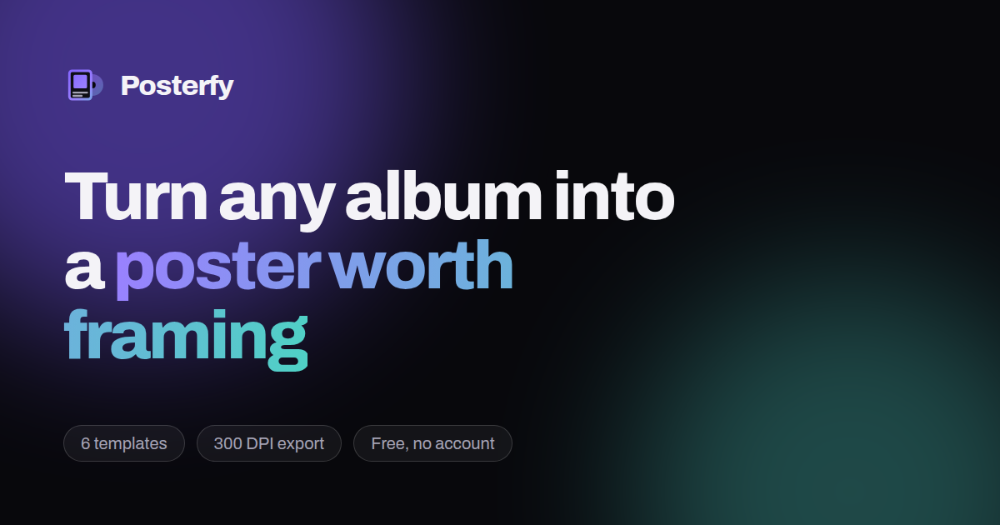

# Posterfy

Turn any album into a print-ready poster. Search a record, pick one of six templates, tune every detail, and download a file you can send straight to a print shop.

Everything is rendered in the browser with the Canvas 2D API — no uploads, no accounts, no watermarks.



---

## Highlights

- **Live album search** — types-as-you-go against Spotify, with MusicBrainz + Cover Art Archive as a keyless fallback, and full manual entry when neither has the record.
- **Six real templates** — Classic, Editorial, Minimal, Vinyl, Split and Duotone. Each is a genuinely different layout, not a recolour.
- **Deep customisation** — templates, five print formats, four type pairings, palette extracted from the artwork, per-swatch colour control, element toggles, tracklist editing, grain, vignette, margins, corner radius and text scale.
- **Print-ready export** — PNG, JPEG or WebP up to 300 DPI, sized for A4/A3/A2, 12×18 in and 24×36 in. Plus share-sheet and clipboard export.
- **Works on a phone** — the complete editor, not a reduced version: sticky preview, tabbed panels, touch-sized controls and a persistent download bar.
- **Six languages**, detected from the browser and the device time zone: English, Deutsch, Español, Français, Português (BR), Italiano.
- **Installable PWA** — after the first visit it edits and exports offline.
- **Private by construction** — no accounts, no analytics, no cookies. Settings and the current poster live in `localStorage` and nowhere else.

## Quick start

```bash
npm install
npm run dev          # http://localhost:5173
```

The app works immediately with no configuration: album search falls back to MusicBrainz and the Cover Art Archive, which need no credentials.

To enable Spotify search locally, copy `.env.example` to `.env` and fill in a client ID and secret from the [Spotify developer dashboard](https://developer.spotify.com/dashboard):

```bash
cp .env.example .env
# SPOTIFY_CLIENT_ID=...
# SPOTIFY_CLIENT_SECRET=...
```

`.env` is git-ignored. The secret is only ever read by the server.

## Scripts

| Script                  | What it does                                           |
| ----------------------- | ------------------------------------------------------ |
| `npm run dev`           | Vite dev server with the `/api` routes mounted         |
| `npm run build`         | Typecheck, then build to `dist/`                       |
| `npm start`             | Serve `dist/` and the API from the bundled Node server |
| `npm run serve`         | `build` followed by `start`                            |
| `npm test`              | Run the Vitest suite                                   |
| `npm run test:coverage` | Tests with a V8 coverage report                        |
| `npm run lint`          | ESLint                                                 |
| `npm run typecheck`     | `tsc --noEmit`                                         |
| `npm run format`        | Prettier, write mode                                   |
| `npm run verify`        | Everything CI runs, in one command                     |
| `npm run assets`        | Regenerate the PWA icons and OG image                  |

## How it works

### Rendering

Templates draw on a fixed **1000-unit-wide grid**; the height comes from the chosen format's aspect ratio. `renderPoster()` scales the canvas context once, so the same code produces a 380 px preview and a 3600 px print file — what you see really is what you get, down to the letter spacing.

```
src/lib/poster/
├── render.ts       orchestration: theme resolution, asset loading, scaling
├── templates/      one file per layout
├── blocks.ts       shared pieces (headline, meta column, tracklist, palette)
├── text.ts         measurement, wrapping, fitting, column balancing
├── effects.ts      artwork fitting, rounded rects, grain, vignette, duotone
└── export.ts       offscreen re-render → Blob → download/share/clipboard
```

The tracklist measures itself and shrinks until it fits the space a template allows, so a 25-track album stays readable instead of overflowing.

### Colour

The palette is quantised from the artwork with median cut (`src/lib/color/color.ts`), then every text colour is checked against the background with the WCAG contrast formula and nudged until it passes. Auto-coloured posters cannot come out unreadable.

### Data providers

| Provider                                  | Credentials | Used when                                     |
| ----------------------------------------- | ----------- | --------------------------------------------- |
| Spotify (via `/api/search`, `/api/album`) | server-side | `SPOTIFY_CLIENT_ID` / `SECRET` are set        |
| Spotify (direct from browser)             | user's own  | Static deploy + credentials saved in Settings |
| MusicBrainz + Cover Art Archive           | none        | Always available as the fallback              |
| Manual entry                              | none        | Anything the databases don't have             |

**Artwork** comes from Spotify whenever credentials are configured — including for albums whose _metadata_ came from MusicBrainz, where the cover is resolved by matching title and artist. The Cover Art Archive is used only when there are no Spotify credentials, because it has no image at all for a large share of release groups. A match is only accepted when title and artist agree, so a wrong sleeve is never substituted.

Note that Spotify's largest cover is 640×640, so very large prints upscale the artwork.

`/api/image` re-serves remote artwork with permissive CORS headers so exports never hit a tainted canvas. Only Spotify's and the Cover Art Archive's hosts are allowed through it.

## Deployment

The same request handler (`server/api.js`) backs all three targets, so behaviour is identical everywhere.

### Node / Docker — full Spotify search

```bash
docker build -t posterfy .
docker run -p 8080:8080 \
  -e SPOTIFY_CLIENT_ID=... \
  -e SPOTIFY_CLIENT_SECRET=... \
  posterfy
```

Or without Docker: `npm run build && npm start`.

### Vercel — full Spotify search

The recommended target. Import the repository at [vercel.com/new](https://vercel.com/new); everything is preconfigured:

- `api/[[...slug]].js` is a catch-all function, so every `/api/*` path reaches the shared handler with its URL intact.
- `vercel.json` sets the build command, the SPA rewrite, cache headers for hashed assets and the security headers.
- The build is detected from `package.json`; Node 20+ comes from the `engines` field.

Add the credentials under **Settings → Environment Variables** (Production, Preview and Development):

```
SPOTIFY_CLIENT_ID       = your client id
SPOTIFY_CLIENT_SECRET   = your client secret
```

Redeploy after adding them. `/api/config` reports `{"spotify": true}` once the server can see them, and the Settings page shows "Spotify search is enabled on this deployment."

Finally, add the deployment URL to your Spotify app's redirect/allowed origins if you later add user login — the client-credentials flow used for search does not need it.

### GitHub Pages / Netlify — static

`.github/workflows/deploy-pages.yml` builds and publishes on every push to `main`. Enable it once under **Settings → Pages → Source: GitHub Actions**.

Two things worth knowing before you pick this option:

1. **A static host has no server**, so there is nowhere to keep a Spotify client secret. Anything baked into the build is readable by every visitor. The Pages build therefore ships **without** Spotify credentials: search uses MusicBrainz and the Cover Art Archive, which work well and need no keys. Individual visitors can add their own Spotify credentials under **Settings** — those stay in their browser.
2. **GitHub Pages sites are publicly readable**, even when the repository is private. Making the repo private protects the source, not the published site.

If you want Spotify search for every visitor, deploy the Node server or the Vercel function instead — those keep the secret server-side.

## Configuration

| Variable                | Scope  | Purpose                                               |
| ----------------------- | ------ | ----------------------------------------------------- |
| `SPOTIFY_CLIENT_ID`     | server | Enables Spotify search                                |
| `SPOTIFY_CLIENT_SECRET` | server | Enables Spotify search                                |
| `PORT`                  | server | Port for `npm start` (default `8080`)                 |
| `ALLOWED_ORIGINS`       | server | Comma-separated CORS allowlist (default: same-origin) |
| `VITE_BASE_PATH`        | build  | Sub-path deployments, e.g. `/Posterfy/`               |
| `VITE_SITE_URL`         | build  | Canonical URL for meta tags                           |
| `VITE_CONTACT_EMAIL`    | build  | Contact address shown in the UI                       |

## Project layout

```
├── api/                 Vercel function wrapper
├── server/              API handler + zero-dependency static server
├── public/              icons, fonts, manifest, service worker, robots, sitemap
├── scripts/             icon and OG image generation
└── src/
    ├── components/      UI, editor panels, poster canvas, 3D scenes, search
    ├── hooks/           scroll reveal, scroll progress, media queries
    ├── i18n/            dictionaries and locale detection
    ├── lib/
    │   ├── api/         provider clients
    │   ├── color/       quantisation and contrast
    │   ├── poster/      the rendering engine
    │   ├── store/       settings and editor state
    │   └── utils/       formatting and helpers
    ├── pages/           one file per route
    └── styles/          design tokens, base, glass, animations
```

## Accessibility

Skip link, visible focus rings, `switch`/`radiogroup`/`combobox` semantics on the custom controls, 44 px minimum touch targets, live regions for toasts, and full keyboard operation in the search box. Every animation is disabled under `prefers-reduced-motion`, and there is an in-app **Reduce motion** switch as well.

## Adding a language

1. Copy `src/i18n/locales/en.ts` and translate the values.
2. Register it in `SUPPORTED_LOCALES` and `LOCALE_NAMES` in `src/i18n/detect.ts`.
3. Add it to `DICTIONARIES` in `src/i18n/index.tsx`.
4. Optionally map its time zones in `TIMEZONE_LOCALES` for auto-detection.

The test suite fails if any locale is missing a key the English dictionary has.

## Adding a template

1. Create `src/lib/poster/templates/<name>.ts` exporting `render<Name>(rc, locale)`.
2. Compose it from the helpers in `blocks.ts` — they handle fitting and contrast.
3. Register it in `templates/index.ts`, `TEMPLATE_META` and the `TemplateId` union.

The renderer smoke test automatically covers every registered template across all formats.

## Legal

Posterfy is not affiliated with, endorsed by, or sponsored by Spotify AB or the MetaBrainz Foundation. Album artwork and album, artist and track names belong to their respective rights holders; posters made with this tool are intended for personal use.

## Licence

[MIT](LICENSE)
